Hi 👋, I'm Muhammad Habib

Exploring Artificial Intelligence, Building with Python, and Contributing to Open Source

 

👨‍💻 About Me

🔭 I'm currently working on MCPs, Deep Learning, and AI projects

🌱 I'm currently learning AI Engineering and Model Fine-Tuning

🤝 I'm looking to collaborate and grow in AI Engineering

💬 Ask me about Python, AI, HTML, CSS, and JavaScript

👨‍💻 Explore all my projects on GitHub

📫 Reach me at m.habib.guru@gmail.com

⚡ Fun fact: When I focus, I build!

🛠️ Languages and Tools

AI, Machine Learning & Data

  &nbsp;
  &nbsp;
  &nbsp;
  &nbsp;
  

Development, Databases & Cloud

  &nbsp;
  &nbsp;
  &nbsp;
  &nbsp;
  &nbsp;
  &nbsp;
  &nbsp;
  &nbsp;
  &nbsp;
  &nbsp;
  &nbsp;
  &nbsp;
  

  

🤝 Connect With Me

  
  
  

